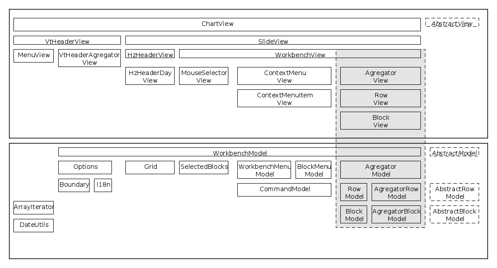

jQuery.Scheduler Documentation
==============================
API
---
see Jquery Widget function list in jquery.scheduler.js

Class Diagram
-------------

Tests (casper.js)
-----------------
1. Install phantom.js (> v1.8)

        wget https://phantomjs.googlecode.com/files/phantomjs-1.9.1-linux-x86_64.tar.bz2
        tar -xjvf phantomjs-1.9.1-linux-x86_64.tar.bz2
        cd phantomjs-1.9.1-linux-x86_64
        ln -sf `pwd`/bin/casperjs /usr/local/bin/casperjs
2. Install casper.js (HEAD git)

        git clone git://github.com/n1k0/casperjs.git
        cd casperjs
        ln -sf `pwd`/bin/casperjs /usr/local/bin/casperjs
3. (optional) config PATH's on js/css  test/functional/scheduler/pages/config.js et test/functional/start_test.sh
4. Run the test 

        cd tests/functional/scheduler/ && sh start_test.sh"
